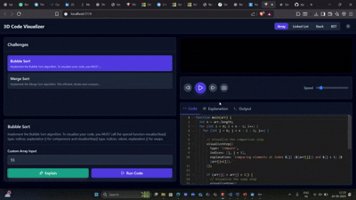
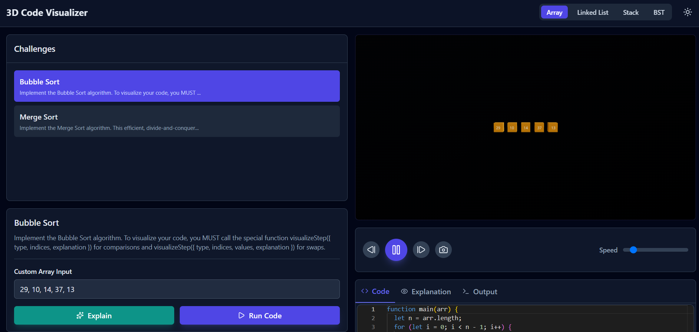
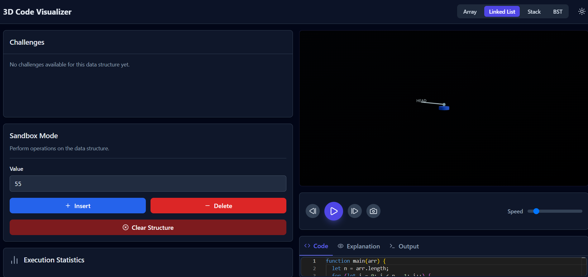
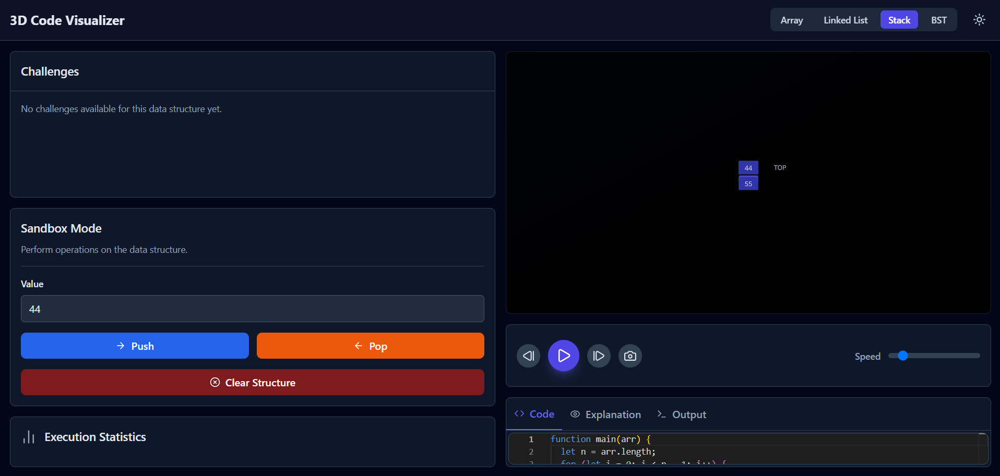
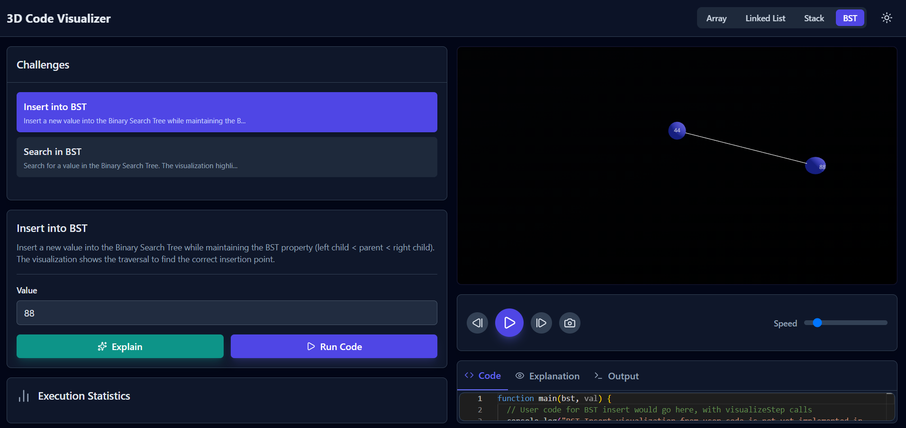

# AlgoGenesis-3D ✨: Visualize Your Code in a New Dimension


---

## 🚀 Ignite Your Algorithms: Real-time 3D Visualization & AI Explanations

AlgoGenesis-3D is a cutting-edge platform to **demystify complex algorithms** by transforming them into **interactive, visually stunning 3D animations**. Select problems from popular coding platforms, write your code, and watch every step of its execution unfold dynamically. Coupled with **AI explanations**, this tool is perfect for understanding, debugging, and mastering algorithms.  

---

## 📸 Project Showcase

### Demo
  
*Example: An array being sorted in real-time within the 3D visualizer.*

### Screenshots
  
*Launching the 3D visualizer.*

  
*Selecting a coding problem from LeetCode.*

  
*Real-time execution of the algorithm with 3D visualization.*

  
*AI-powered explanation of the algorithm, including time and space complexity.*

---

## 🌟 Features

* **Platform Integration**: Fetch problems from **LeetCode**, **CodeChef**, **Codeforces**.
* **Interactive 3D Visualization**: Arrays, trees, and graphs come alive with **Three.js** & **React Three Fiber**.
* **Dynamic Error Highlighting**: Spot logical errors and inefficiencies visually.
* **Real-time Code Editor**: Syntax highlighting, auto-complete, and live feedback.
* **Step-by-Step Controls**: Play, Pause, Step Forward/Backward, Reset.
* **AI Explanations**: Powered by **Groq API**, including complexity analysis.
* **Futuristic UI/UX**: Neon-accented, sleek interface built with **Next.js** and **Tailwind CSS**.

---

## 🛠️ Tech Stack

### Frontend
* **Framework**: 
* **Styling**: 
* **3D Graphics**:  / 
* **Animation**: `framer-motion-3d`
* **Code Editor**: `react-simple-code-editor`

### Backend
* **Runtime**: 
* **Framework**: 
* **Database**: 
* **Code Sandboxing**: `vm2`

### AI & APIs
* **AI Explanations**: 
* **Problem Fetching**: `axios`

---

## ⚡ Installation & Getting Started

### Prerequisites
* **Node.js** v18.x or higher ([Download Node.js](https://nodejs.org/))
* **MongoDB** running locally or via cloud (MongoDB Atlas)  
* **Groq API Key** ([Get API Key](https://console.groq.com/keys))

---

### 1️⃣ Clone the Repository
```bash
git clone https://github.com/kh-bikash/algogenesis-3d.git
cd algogenesis-3d
```

2️⃣ Install Frontend Dependencies
cd frontend
npm install

3️⃣ Install Backend Dependencies
cd ../backend
npm install

4️⃣ Configure Environment Variables

Create a .env file in the backend folder:

MONGO_URI=<your_mongodb_connection_string>
GROQ_API_KEY=<your_groq_api_key>
PORT=5000

5️⃣ Start the Application

Backend

cd backend
npm run start


Frontend (separate terminal)

cd frontend
npm run dev

6️⃣ Access the App

Open your browser and go to:

http://localhost:3000

📚 Learning Outcomes

Mastered 3D animation with Three.js & React Three Fiber

Integrated AI explanations with Groq API

Built a full-stack application: React + Node.js + MongoDB

Created an interactive platform to visualize algorithms dynamica
